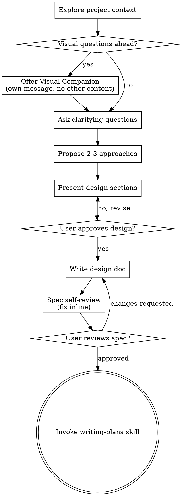

# 把想法变成设计

通过自然、协作式的对话，把模糊想法逐步收敛成完整设计与 spec。

先理解当前项目上下文，再一次只问一个问题来不断收敛这个想法。当你真正理解要构建什么之后，先呈现设计，再拿到用户批准。

<HARD-GATE>
在你展示设计并拿到用户批准之前，不要调用任何实现型 skill，不要写代码，不要 scaffold 项目，也不要做任何实现动作。这条规则适用于每一个项目，不管它看起来有多简单。
</HARD-GATE>

## 反模式：“这个太简单了，不需要设计”

每个项目都必须经过这套流程。Todo list、单函数小工具、配置改动，全都一样。越是“简单”的项目，越容易因为没检查的前提假设而浪费大量时间。设计可以很短，真正简单的项目也许只要几句话，但你**必须**先呈现它，并获得批准。

## 检查清单

你必须为下面每一项创建任务，并按顺序完成：

1. **探索项目上下文** — 检查文件、文档和最近提交
2. **提供 visual companion**（如果这个主题会涉及视觉问题）— 这必须单独成一条消息，不能和澄清问题混在一起。具体见下方 Visual Companion
3. **提出澄清问题** — 一次一个，理解目标 / 约束 / 成功标准
4. **提出 2 到 3 种方案** — 说明权衡，并给出你的推荐
5. **呈现设计** — 按复杂度拆成不同部分，每部分讲完都获取用户确认
6. **写 design doc** — 保存到 `docs/superpowers/specs/YYYY-MM-DD-<topic>-design.md` 并提交
7. **Spec 自审** — 快速检查占位符、矛盾、歧义和范围（见下文）
8. **让用户审阅书面 spec** — 在继续前，明确让用户审阅 spec 文件
9. **转入实现阶段** — 调用 writing-plans skill 创建实现计划

## 流程图

**终点状态只有一个：调用 writing-plans。** 不要调用 frontend-design、mcp-builder，或任何其他实现型 skill。brainstorming 之后唯一应该进入的 skill 是 writing-plans。

## 具体流程

**理解这个想法：**

- 先检查当前项目状态（文件、文档、最近提交）
- 在深入提问前先做范围评估：如果用户的请求实际上覆盖多个彼此独立的子系统（例如“做一个带聊天、文件存储、计费和分析的平台”），要立刻指出这一点。不要在一个本该先拆分的项目上继续细化实现细节
- 如果项目对单个 spec 来说太大，就帮助用户拆成多个子项目：有哪些独立模块，它们如何关联，应该按什么顺序做。然后只对第一个子项目走完整 brainstorm 流程。每个子项目都应有自己的 spec → plan → implementation 闭环
- 对于范围合理的项目，一次只问一个问题，把想法逐步收敛
- 能用选择题就优先用选择题，开放问题也可以
- 每条消息只问一个问题，如果一个话题需要深挖，就拆成多轮
- 聚焦理解：目标、约束、成功标准

**探索方案：**

- 提出 2 到 3 种不同方案，并说明它们的权衡
- 用对话式方式呈现，并给出你的推荐和理由
- 先说你推荐的方案，再解释为什么

**呈现设计：**

- 一旦你觉得自己已经理解要构建什么，就开始呈现设计
- 每一部分的长度按复杂度决定：简单的几句话，复杂的可写到 200 到 300 词
- 每一部分讲完后，都要问用户“到这里是否正确”
- 至少覆盖：架构、组件、数据流、错误处理、测试
- 如果中途发现有地方说不通，要愿意退回去继续澄清

**为隔离与清晰而设计：**

- 把系统拆成更小的单元，每个单元只有一个清晰职责，并通过明确接口沟通，可以独立理解和测试
- 对每个单元，你都应该能回答：它做什么、如何使用它、它依赖什么
- 如果不看内部实现就无法知道一个单元做什么，或者你一改内部实现就会把外部调用方搞坏，那边界就还不够清晰
- 小而边界明确的单元也更适合你自己处理，因为你更擅长在有限上下文中推理代码，文件越聚焦，编辑越可靠。当一个文件越来越大，通常就是它承担了太多职责

**在已有代码库中工作：**

- 在提出改动前，先理解当前结构。遵循现有模式
- 如果现有代码中存在会影响本次工作的结构问题（例如文件过大、边界不清、职责缠绕），可以把这些与当前任务直接相关的改进纳入设计
- 不要提出与目标无关的重构。始终聚焦当前问题

## 设计之后

**文档化：**

- 把已验证的设计（spec）写入 `docs/superpowers/specs/YYYY-MM-DD-<topic>-design.md`
  - 如果用户对 spec 存放位置有偏好，以用户偏好为准
- 如可用，可使用 `elements-of-style:writing-clearly-and-concisely` skill
- 把 design 文档提交到 git

**Spec 自审：**
写完 spec 后，用新的眼光重新读一遍：

1. **占位符扫描：** 是否还有 "TBD"、"TODO"、未完成章节或含糊需求？修掉。
2. **内部一致性：** 是否有章节互相矛盾？架构描述是否和功能描述一致？
3. **范围检查：** 这个 spec 是否足够聚焦，能支撑一份单独 implementation plan？如果不能，就继续拆分。
4. **歧义检查：** 某个需求是否可以被理解成两种不同实现？如果是，就选定一种并写死。

发现问题就直接在文档里修。不要重新 review，修完继续就行。

**用户审阅闸门：**
在 spec review loop 通过后，明确让用户先看一遍书面 spec：

> "Spec written and committed to `<path>`. Please review it and let me know if you want to make any changes before we start writing out the implementation plan."

等待用户回应。如果用户要求改动，就修改并重新走 spec review loop。只有在用户明确批准后，才能继续。

**实现阶段：**

- 调用 writing-plans skill，创建详细实现计划
- 不要调用任何其他 skill。下一步只有 writing-plans

## 关键原则

- **一次只问一个问题** - 不要一次抛给用户太多问题
- **优先选择题** - 能选项就不要让用户写长篇开放回答
- **残酷执行 YAGNI** - 从所有设计中删掉没必要的东西
- **先比较方案** - 在收敛前，始终给出 2 到 3 种方案
- **增量式验证** - 先呈现设计，拿到批准，再继续
- **保持灵活** - 发现哪里讲不通，就退回去补澄清

## Visual Companion

这是一个基于浏览器的辅助工具，用于在 brainstorming 过程中展示 mockup、图表和视觉选项。它是一个工具，不是一种模式。用户同意开启 companion，意味着当后续问题适合视觉化时你可以使用它，并不意味着所有问题都必须走浏览器。

**如何提出 companion：** 当你预判接下来会涉及视觉内容（mockup、布局、图示等）时，可以先单独询问一次：

> "Some of what we're working on might be easier to explain if I can show it to you in a web browser. I can put together mockups, diagrams, comparisons, and other visuals as we go. This feature is still new and can be token-intensive. Want to try it? (Requires opening a local URL)"

**这个提议必须单独成消息。** 不能和澄清问题、上下文总结或任何其他内容混在一起。这条消息只能包含上面这个提议。等用户答复后再继续。如果用户拒绝，就完全按文本模式进行 brainstorming。

**每个问题单独判断：** 即便用户同意了 companion，你也要对每一个问题重新判断，是该走浏览器还是终端。判断标准只有一个：**用户是“看到它”更容易理解，还是“读到它”就够了？**

- **用浏览器**：当内容本身就是视觉性的，比如 mockup、线框图、布局对比、架构图、并排视觉方案
- **用终端**：当内容本质上是文字性的，比如需求澄清、概念选择、权衡分析、A/B/C/D 文本选项、范围决策

一个话题和 UI 有关，不代表它天然就该走视觉化。“personality 在这个上下文里是什么意思？” 这是概念问题，用终端；“哪个 wizard 布局更合适？” 这是视觉问题，用浏览器。

如果用户同意使用 companion，在继续前先阅读详细指南：
`skills/brainstorming/visual-companion.md`
