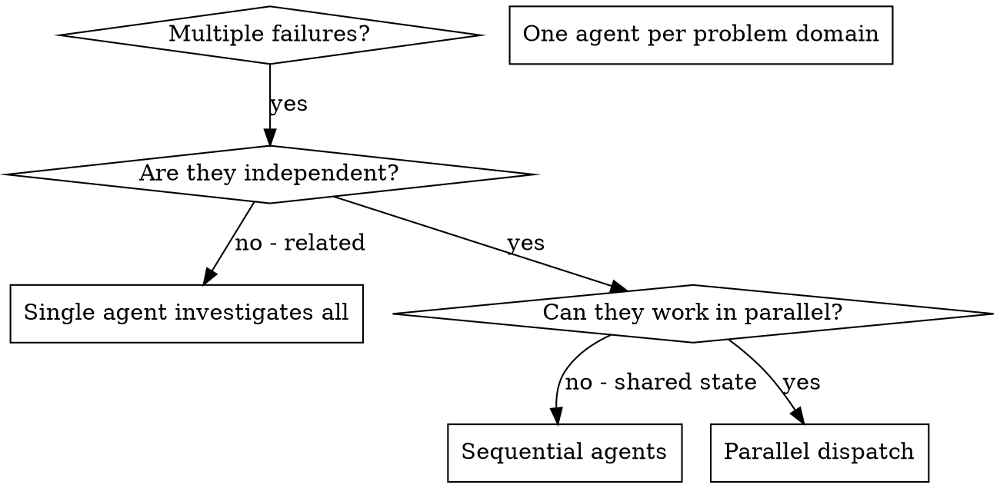

# 派发并行 Agents

## 概览

你可以把任务委派给具备隔离上下文的专门 agents。通过精确构造它们的指令与上下文，你能确保它们聚焦并成功完成自己的那部分任务。它们不应该继承你当前会话的上下文或历史，而是只接收你明确交给它们的必要信息。这样也能保留你自己的上下文，用于做协调工作。

当你遇到多个彼此无关的失败（不同测试文件、不同子系统、不同 bug）时，按顺序一个一个查只是在浪费时间。每个问题都是独立的，就应该并行推进。

**核心原则：** 每个独立问题域派发一个 agent，让它们并发工作。

## 什么时候使用



**适用场景：**
- 3 个以上测试文件失败，且根因不同
- 多个子系统彼此独立地坏掉
- 每个问题都能在不依赖其他问题上下文的前提下被理解
- 各调查之间没有共享状态

**不适用场景：**
- 失败彼此相关（修一个可能顺带修掉其他）
- 必须先理解整个系统状态
- agents 之间会互相干扰

## 模式

### 1. 识别独立问题域

按“哪里坏了”来分组：
- 文件 A 测试：Tool approval 流程
- 文件 B 测试：Batch completion 行为
- 文件 C 测试：Abort 功能

每个域都是独立的，修 tool approval 不应该影响 abort 测试。

### 2. 创建聚焦的 Agent 任务

每个 agent 需要：
- **明确范围：** 只负责一个测试文件或一个子系统
- **清晰目标：** 让这组测试通过
- **约束条件：** 不要改其他代码
- **预期输出：** 总结它发现了什么、修了什么

### 3. 并行派发

```typescript
// 在 Claude Code / AI 环境中
Task("Fix agent-tool-abort.test.ts failures")
Task("Fix batch-completion-behavior.test.ts failures")
Task("Fix tool-approval-race-conditions.test.ts failures")
// 三个任务并发执行
```

### 4. 审查并集成

当 agents 返回后：
- 阅读每份总结
- 验证修复之间没有冲突
- 运行完整测试套件
- 把所有改动整合起来

## Agent Prompt 结构

好的 agent prompt 应该满足：
1. **聚焦**，只针对一个清晰问题域
2. **自包含**，让 agent 拿到理解问题所需的全部上下文
3. **明确输出要求**，告诉 agent 最终该返回什么

```markdown
Fix the 3 failing tests in src/agents/agent-tool-abort.test.ts:

1. "should abort tool with partial output capture" - expects 'interrupted at' in message
2. "should handle mixed completed and aborted tools" - fast tool aborted instead of completed
3. "should properly track pendingToolCount" - expects 3 results but gets 0

These are timing/race condition issues. Your task:

1. Read the test file and understand what each test verifies
2. Identify root cause - timing issues or actual bugs?
3. Fix by:
   - Replacing arbitrary timeouts with event-based waiting
   - Fixing bugs in abort implementation if found
   - Adjusting test expectations if testing changed behavior

Do NOT just increase timeouts - find the real issue.

Return: Summary of what you found and what you fixed.
```

## 常见错误

**❌ 范围太大：** “Fix all the tests”，agent 很容易迷失  
**✅ 足够具体：** “Fix agent-tool-abort.test.ts”，范围聚焦

**❌ 没有上下文：** “Fix the race condition”，agent 不知道去哪里看  
**✅ 有上下文：** 直接贴错误信息和测试名

**❌ 没有约束：** agent 可能把整套东西都重构了  
**✅ 有约束：** “Do NOT change production code” 或 “Fix tests only”

**❌ 输出要求模糊：** “Fix it”，你根本不知道具体改了什么  
**✅ 输出要求明确：** “Return summary of root cause and changes”

## 什么时候不要用

**相关失败：** 修一个可能顺带修掉其他，应该先合并调查  
**需要完整上下文：** 必须先看懂整个系统  
**探索性调试：** 你还不知道到底哪里坏了  
**共享状态：** agents 会互相干扰（改同一组文件、争用同一资源）

## 来自真实会话的例子

**场景：** 一次大重构后，3 个文件里出现 6 个测试失败

**失败分布：**
- `agent-tool-abort.test.ts`：3 个失败（时序问题）
- `batch-completion-behavior.test.ts`：2 个失败（tools 没有执行）
- `tool-approval-race-conditions.test.ts`：1 个失败（execution count = 0）

**判断：** 这些是独立问题域，abort 逻辑、batch completion 和 race conditions 各自分离

**派发方式：**
```
Agent 1 → 修复 agent-tool-abort.test.ts
Agent 2 → 修复 batch-completion-behavior.test.ts
Agent 3 → 修复 tool-approval-race-conditions.test.ts
```

**结果：**
- Agent 1：把 timeout 替换成 event-based waiting
- Agent 2：修复事件结构 bug（`threadId` 放错位置）
- Agent 3：加入等待异步 tool execution 完成的逻辑

**集成结果：** 所有修复彼此独立，没有冲突，整套测试最终变绿

**节省时间：** 3 个问题并行解决，而不是顺序一个个排查

## 关键收益

1. **并行化**：多个调查同时发生
2. **更聚焦**：每个 agent 的上下文更窄，更容易盯住重点
3. **相互独立**：agents 之间互不干扰
4. **更快**：用解决 1 个问题的时间，解决 3 个问题

## 验证

当 agents 返回后：
1. **阅读每份总结**，搞清楚改了什么
2. **检查是否冲突**，是否改到了同一段代码
3. **运行完整测试套件**，确认所有修复能一起成立
4. **抽样检查**，因为 agents 也可能犯系统性错误

## 真实收益

来自一次调试会话（2025-10-03）：
- 3 个文件里出现 6 个失败
- 并行派发了 3 个 agents
- 所有调查并发完成
- 所有修复成功整合
- agent 改动之间 0 冲突
