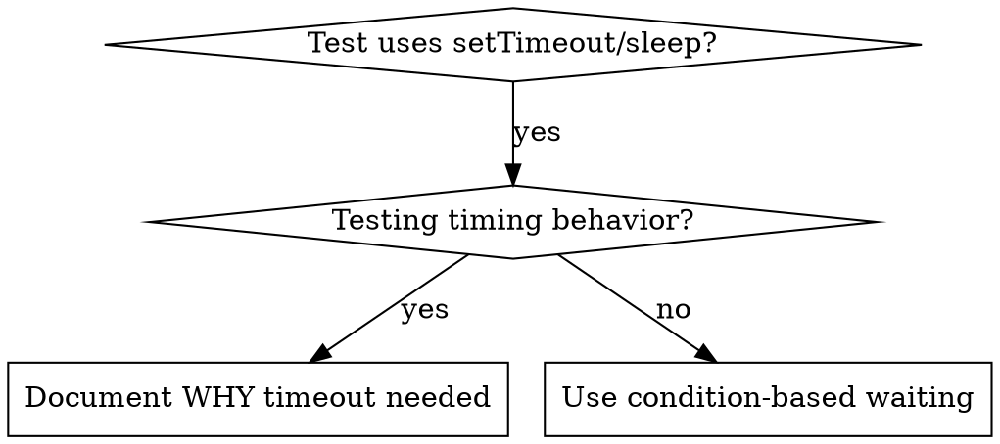

# 基于条件的等待

## 概览

脆弱的测试经常通过拍脑袋的固定延迟来赌时序。这很容易制造 race condition，结果就是在快机器上能过，在负载高或 CI 环境里就挂。

**核心原则：** 等待你真正关心的条件成立，而不是猜测它大概需要多久。

## 什么时候使用



**适用场景：**
- 测试里有随意设置的延迟（`setTimeout`、`sleep`、`time.sleep()`）
- 测试有 flaky 问题（有时通过，在负载下失败）
- 测试并行运行时经常超时
- 需要等待异步操作完成

**不适用场景：**
- 你测试的本来就是时序行为本身（例如 debounce、throttle 间隔）
- 如果必须用任意 timeout，一定要写清楚为什么

## 核心模式

```typescript
// ❌ 之前：靠猜时序
await new Promise(r => setTimeout(r, 50));
const result = getResult();
expect(result).toBeDefined();

// ✅ 之后：等待条件成立
await waitFor(() => getResult() !== undefined);
const result = getResult();
expect(result).toBeDefined();
```

## 常见模式

| 场景 | 模式 |
|------|------|
| 等待事件 | `waitFor(() => events.find(e => e.type === 'DONE'))` |
| 等待状态 | `waitFor(() => machine.state === 'ready')` |
| 等待数量 | `waitFor(() => items.length >= 5)` |
| 等待文件 | `waitFor(() => fs.existsSync(path))` |
| 复杂条件 | `waitFor(() => obj.ready && obj.value > 10)` |

## 实现

通用轮询函数：
```typescript
async function waitFor<T>(
  condition: () => T | undefined | null | false,
  description: string,
  timeoutMs = 5000
): Promise<T> {
  const startTime = Date.now();

  while (true) {
    const result = condition();
    if (result) return result;

    if (Date.now() - startTime > timeoutMs) {
      throw new Error(`Timeout waiting for ${description} after ${timeoutMs}ms`);
    }

    await new Promise(r => setTimeout(r, 10)); // 每 10ms 轮询一次
  }
}
```

完整实现见当前目录下的 `condition-based-waiting-example.ts`，其中包含来自真实调试会话的领域辅助函数，例如 `waitForEvent`、`waitForEventCount`、`waitForEventMatch`。

## 常见错误

**❌ 轮询过快：** `setTimeout(check, 1)`，浪费 CPU  
**✅ 修正：** 每 10ms 轮询一次

**❌ 没有 timeout：** 如果条件永远达不到，就会死循环  
**✅ 修正：** 总是加上 timeout，并配清晰错误信息

**❌ 使用陈旧数据：** 在循环前就把状态缓存下来  
**✅ 修正：** 在循环内部调用 getter，保证拿到新值

## 什么时候任意 Timeout 才是对的

```typescript
// 工具每 100ms tick 一次，需要 2 个 tick 才能验证部分输出
await waitForEvent(manager, 'TOOL_STARTED'); // 先等待触发条件成立
await new Promise(r => setTimeout(r, 200));   // 再等待预期时序行为发生
// 200ms = 100ms 间隔下的 2 个 tick，原因清楚且有说明
```

**要求：**
1. 先等待触发条件成立
2. 必须基于已知时序，而不是瞎猜
3. 注释里写清楚 WHY

## 真实收益

来自一次调试会话（2025-10-03）的结果：
- 修复了 3 个文件中的 15 个 flaky tests
- 通过率：60% → 100%
- 执行时间：快了 40%
- race condition 不再出现
