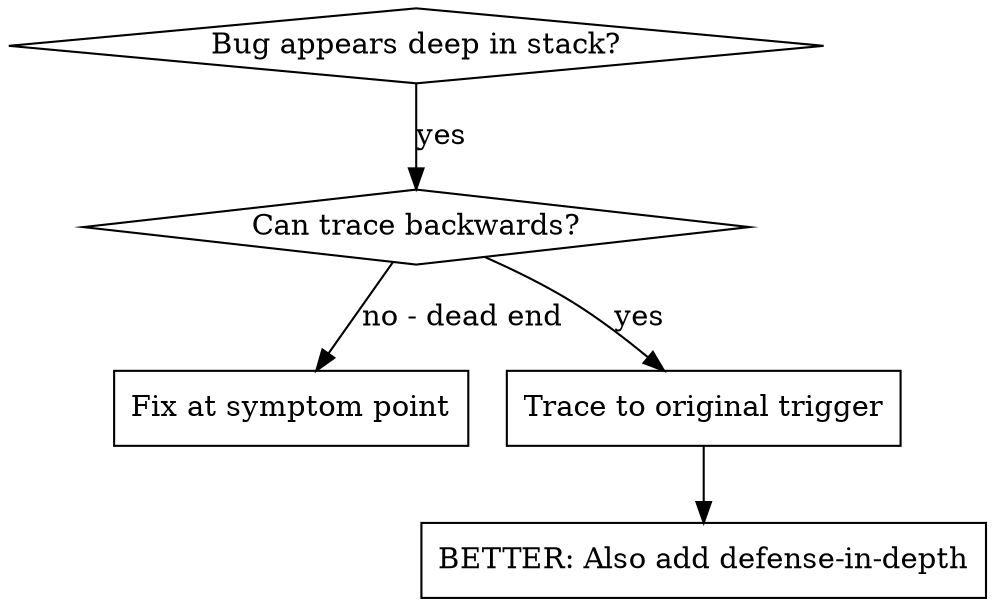
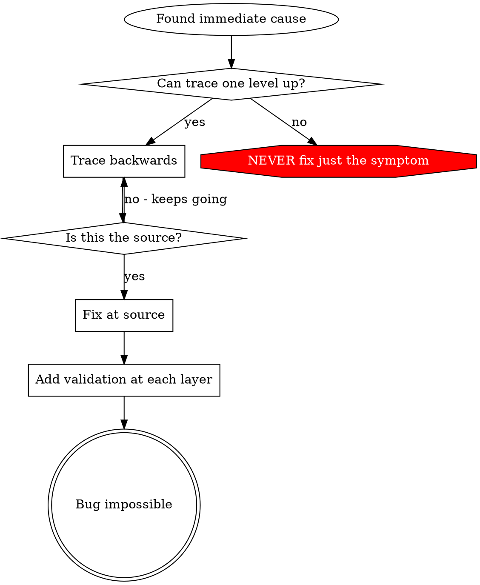

# 根因追踪

## 概览

很多 bug 都是在调用栈很深的位置显现出来（例如在错误目录执行了 `git init`、在错误位置创建了文件、数据库用错了路径）。你的本能很容易是在报错点直接修，但那只是在处理症状。

**核心原则：** 沿着调用链逆向追踪，直到找到原始触发点，再在源头修复。

## 什么时候使用



**适用场景：**
- 错误发生在执行链很深的位置，而不是入口
- stack trace 很长
- 不清楚无效数据从哪里开始产生
- 你需要找出到底是哪段测试 / 哪段代码触发了它

## 追踪过程

### 1. 观察症状
```
Error: git init failed in /Users/jesse/project/packages/core
```

### 2. 找到直接原因
**到底是哪段代码直接导致了这个结果？**
```typescript
await execFileAsync('git', ['init'], { cwd: projectDir });
```

### 3. 问：是谁调用了这里？
```typescript
WorktreeManager.createSessionWorktree(projectDir, sessionId)
  → called by Session.initializeWorkspace()
  → called by Session.create()
  → called by test at Project.create()
```

### 4. 持续往上追
**传进来的值是什么？**
- `projectDir = ''`（空字符串！）
- 空字符串作为 `cwd` 时会解析成 `process.cwd()`
- 而那正是源代码目录

### 5. 找到原始触发点
**空字符串最初从哪来？**
```typescript
const context = setupCoreTest(); // Returns { tempDir: '' }
Project.create('name', context.tempDir); // Accessed before beforeEach!
```

## 加 Stack Trace

如果你没法手工继续往上追，就加埋点：

```typescript
// 在危险操作之前
async function gitInit(directory: string) {
  const stack = new Error().stack;
  console.error('DEBUG git init:', {
    directory,
    cwd: process.cwd(),
    nodeEnv: process.env.NODE_ENV,
    stack,
  });

  await execFileAsync('git', ['init'], { cwd: directory });
}
```

**关键点：** 在测试里要用 `console.error()`，不要用 logger，因为 logger 可能根本不会显示出来。

**运行并抓取：**
```bash
npm test 2>&1 | grep 'DEBUG git init'
```

**分析 stack trace：**
- 找测试文件名
- 找触发调用的具体行号
- 识别模式（是不是同一组测试？同一种参数？）

## 找出是哪条测试污染了环境

如果某个问题只会在测试期间出现，但你不知道是哪个测试引发的：

可以用当前目录下的二分脚本 `find-polluter.sh`：

```bash
./find-polluter.sh '.git' 'src/**/*.test.ts'
```

它会逐个测试运行，遇到第一个污染源就停止。具体用法见脚本本身。

## 真实案例：空的 projectDir

**症状：** `.git` 被创建在 `packages/core/`（源码目录）

**追踪链路：**
1. `git init` 在 `process.cwd()` 中执行 ← 因为传入的 cwd 参数为空
2. WorktreeManager 被传入了空的 `projectDir`
3. `Session.create()` 传入了空字符串
4. 测试在 `beforeEach` 之前就访问了 `context.tempDir`
5. `setupCoreTest()` 初始返回 `{ tempDir: '' }`

**真正根因：** 顶层变量初始化时过早访问了一个尚未赋值的空属性

**修复方式：** 把 `tempDir` 改成 getter，一旦在 `beforeEach` 之前访问就直接抛错

**同时补上纵深防御：**
- 第 1 层：`Project.create()` 校验目录
- 第 2 层：`WorkspaceManager` 校验非空
- 第 3 层：`NODE_ENV` 护栏拒绝在 `tmpdir` 外执行 `git init`
- 第 4 层：在 `git init` 前记录 stack trace

## 关键原则



**永远不要只修报错出现的那个点。** 往回追，找到最初触发源。

## Stack Trace 小技巧

**在测试里：** 用 `console.error()`，不要用 logger，因为 logger 可能被压掉  
**在操作前：** 要在危险操作前记录，而不是等它失败了再说  
**带齐上下文：** 记录目录、cwd、环境变量、时间戳  
**捕获调用链：** `new Error().stack` 能给你完整调用链

## 真实收益

来自一次调试会话（2025-10-03）：
- 通过 5 层追踪找到了真正根因
- 在源头修复
- 同时补上 4 层防御
- 1847 个测试通过，零污染
