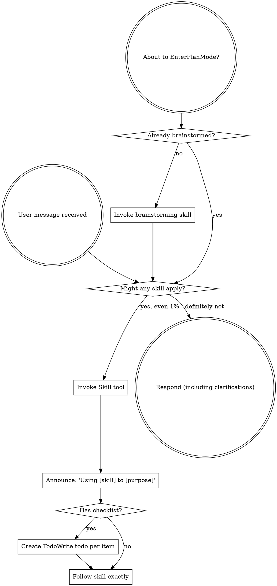

<SUBAGENT-STOP>
如果你是作为 subagent 被派发来执行某个具体任务的，请跳过这个 skill。
</SUBAGENT-STOP>

<EXTREMELY-IMPORTANT>
如果你觉得哪怕只有 1% 的可能某个 skill 适用于当前任务，你也绝对必须调用它。

只要有 skill 适用于你的任务，你就没有选择权。你必须使用它。

这不是可以商量的事。不是可选项。你不能靠自我合理化绕过去。
</EXTREMELY-IMPORTANT>

## 指令优先级

Superpowers skills 会覆盖默认 system prompt 的行为，但 **用户指令始终优先**：

1. **用户的明确指令**（`CLAUDE.md`、`GEMINI.md`、`AGENTS.md`、直接请求）——最高优先级
2. **Superpowers skills** —— 在与默认 system 行为冲突时覆盖它
3. **默认 system prompt** —— 最低优先级

如果 `CLAUDE.md`、`GEMINI.md` 或 `AGENTS.md` 写着 “不要用 TDD”，而某个 skill 却说 “总是使用 TDD”，那就遵循用户指令。控制权在用户手里。

## 如何访问 技能

**在 Claude Code 中：** 使用 `Skill` tool。调用某个 skill 时，它的内容会被加载并直接呈现给你，照着执行即可。不要用 `Read` tool 去读 skill 文件。

**在 Gemini CLI 中：** skills 通过 `activate_skill` tool 激活。Gemini 会在会话启动时加载 skill metadata，并在需要时激活完整内容。

**在其他环境中：** 请查看平台文档，确认 skills 是如何加载的。

## 平台适配

skills 使用 Claude Code 的工具名。非 Claude Code 平台请查看 `references/codex-tools.md`（Codex）里的工具对应关系。Gemini CLI 用户会通过 `GEMINI.md` 自动加载工具映射。

# 使用 技能

## 规则

**在任何响应或行动之前，先调用相关或被请求的 skill。** 只要有 1% 的可能性某个 skill 适用，你就应该先调用它来确认。如果调用后发现这个 skill 不适合当前情况，那可以不用继续执行它。

## 红旗信号

一旦你脑中冒出下面这些念头，就该停下来了，因为你正在给自己找借口：

| 想法 | 现实 |
|------|------|
| “这只是个简单问题” | 问题也是任务，先检查 skill。 |
| “我得先拿到更多上下文” | skill 检查发生在澄清问题之前。 |
| “我先探索一下代码库” | skill 会告诉你怎么探索，先检查。 |
| “我先快速看下 git / 文件” | 文件没有会话上下文，还是先检查 skill。 |
| “我先收集点信息再说” | skill 会告诉你怎么收集信息。 |
| “这不需要正式的 skill” | 只要有 skill，就要用。 |
| “这个 skill 我记得” | skill 会演化，读当前版本。 |
| “这不算一个任务” | 只要有动作，就是任务。先检查 skill。 |
| “这个 skill 太重了” | 简单问题经常会变复杂。先用它。 |
| “我先做这一件小事” | 先检查，再做任何事。 |
| “这样感觉很高效” | 没纪律的行动会浪费时间，skill 是防护栏。 |
| “我知道这是什么意思” | 知道概念 ≠ 使用 skill。先调用。 |

## 技能 优先级

当多个 skill 都可能适用时，使用下面这个顺序：

1. **先用流程型 skills**（如 brainstorming、debugging），它们决定你该如何接近问题
2. **再用实现型 skills**（如 frontend-design、mcp-builder），它们指导具体执行

“Let's build X” → 先 brainstorming，再实现型 skill。  
“Fix this bug” → 先 debugging，再领域专属 skill。

## 技能 类型

**Rigid**（如 TDD、debugging）：严格执行，不要擅自弱化纪律。

**Flexible**（如 patterns）：根据上下文调整原则。

具体属于哪类，以 skill 本身的说明为准。

## 用户指令

用户指令告诉你的是 WHAT，而不是 HOW。像 “Add X” 或 “Fix Y” 这种要求，并不意味着你可以跳过工作流。
