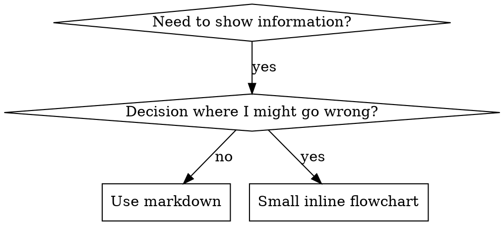

# 编写技能

## 概览

**编写技能，本质上就是把测试驱动开发用到流程文档上。**

**个人技能应放在对应 agent 的专属目录里（Claude Code 使用 `~/.claude/skills`，Codex 使用 `~/.agents/skills/`）。**

先写测试用例（通过子代理构造压力场景），观察它失败（基线行为），再编写技能文档，确认测试通过（agent 开始遵守），最后持续重构并堵住漏洞。

**核心原则：** 如果你没有先观察过 agent 在缺少该技能时如何失败，就无法确认这个技能是否真的教会了正确的东西。

**必要前置：** 在使用本技能前，你必须先理解 `superpowers:test-driven-development`。那个技能定义了基础的 RED-GREEN-REFACTOR 循环，而本技能则把这套方法迁移到文档编写上。

**官方指南：** 如果要查看 Anthropic 官方的技能编写最佳实践，请参见 `anthropic-best-practices.md`。本文提供的是与之互补、且更偏 TDD 的方法与规则。

## 什么是技能？

**技能** 是对已验证技巧、模式或工具的参考指南。它帮助未来的 Claude 实例快速找到并应用有效方法。

**技能可以是：** 可复用的技巧、模式、工具和参考指南

**技能不是：** 你曾经解决过某个问题的一次性故事记录

## 技能的 TDD 映射

| TDD Concept | Skill Creation |
|-------------|----------------|
| **Test case** | Pressure scenario with subagent |
| **Production code** | Skill document (SKILL.md) |
| **Test fails (RED)** | Agent violates rule without skill (baseline) |
| **Test passes (GREEN)** | Agent complies with skill present |
| **Refactor** | 在保持遵循率的前提下堵住漏洞 |
| **Write test first** | Run baseline scenario BEFORE writing skill |
| **Watch it fail** | Document exact rationalizations agent uses |
| **Minimal code** | Write skill addressing those specific violations |
| **Watch it pass** | Verify agent now complies |
| **Refactor cycle** | Find new rationalizations → plug → re-verify |

整个技能创建过程都遵循 RED-GREEN-REFACTOR。

## 什么时候创建技能

**Create when:**
- Technique wasn't intuitively obvious to you
- 你未来会在不同项目里反复参考它
- Pattern applies broadly (not project-specific)
- 其他人也能从中受益

**Don't create for:**
- One-off solutions
- Standard practices well-documented elsewhere
- Project-specific conventions (put in CLAUDE.md)
- Mechanical constraints (if it's enforceable with regex/validation, automate it—save documentation for judgment calls)

## 技能类型

### Technique
带有明确步骤的具体方法，例如 `condition-based-waiting`、`root-cause-tracing`

### Pattern
一种思考问题的方式，例如 `flatten-with-flags`、`test-invariants`

### Reference
API 文档、语法指南、工具说明等参考资料

## Directory Structure


```
skills/
  skill-name/
    SKILL.md              # Main reference (required)
    supporting-file.*     # Only if needed
```

**Flat namespace** - all skills in one searchable namespace

**Separate files for:**
1. **Heavy 参考** (100+ lines) - API docs, comprehensive syntax
2. **Reusable tools** - Scripts, utilities, templates

**保留在主文档里：**
- 原则和概念
- Code patterns (< 50 lines)
- Everything else

## SKILL.md 结构

**Frontmatter (YAML):**
- Two required fields: `name` and `description` (see [agentskills.io/specification](https://agentskills.io/specification) for all supported fields)
- Max 1024 characters total
- `name`: Use letters, numbers, and hyphens only (no parentheses, special chars)
  - `description`: 使用第三人称，只描述适用场景，不描述执行步骤
  - 以 “Use when...” 开头，强调触发条件
  - Include specific symptoms, situations, and contexts
  - **绝不要在 description 里总结技能流程或工作流**（原因见下文 CSO 部分）
  - Keep under 500 characters if possible

```markdown
---
name: Skill-Name-With-Hyphens
description: Use when [specific triggering conditions and symptoms]
---

# 技能 Name

## 概览
What is this? Core principle in 1-2 sentences.

## When to Use
[Small inline flowchart IF decision non-obvious]

Bullet list with SYMPTOMS and use cases
When NOT to use

## Core 模式 (for techniques/patterns)
Before/after code comparison

## Quick Reference
Table or bullets for scanning common operations

## 实现
Inline code for simple patterns
Link to file for heavy reference or reusable tools

## Common Mistakes
What goes wrong + fixes

## Real-World 影响 (optional)
Concrete results
```


## Claude 搜索 Optimization (CSO)

**Critical for discovery:** Future Claude needs to FIND your skill

### 1. Rich 说明 Field

**用途:** Claude reads description to decide which skills to load for a given task. Make it answer: "Should I read this skill right now?"

**Format:** Start with "Use when..." to focus on triggering conditions

**CRITICAL: 说明 = 适用场景, NOT What the Skill Does**

The description should ONLY describe triggering conditions. Do NOT summarize the skill's 流程 or 工作流 in the description.

**Why this matters:** 测试 revealed that when a description summarizes the skill's 工作流, Claude may follow the description instead of reading the full skill content. A description saying "code review between tasks" caused Claude to do ONE review, even though the skill's flowchart clearly showed TWO reviews (spec 遵循率 then code 质量).

When the description was changed to just "Use when executing implementation plans with independent tasks" (no 工作流 summary), Claude correctly read the flowchart and followed the two-stage review 流程.

**The trap:** 说明s that summarize 工作流 create a shortcut Claude will take. The skill body becomes documentation Claude skips.

```yaml
# ❌ BAD: Summarizes 工作流 - Claude may follow this instead of reading 技能
description: Use when executing plans - dispatches subagent per task with code review between tasks

# ❌ BAD: Too much process detail
description: Use for TDD - write test first, watch it fail, write minimal code, refactor

# ✅ GOOD: Just triggering conditions, no 工作流 摘要
description: Use when executing implementation plans with independent tasks in the current session

# ✅ GOOD: Triggering conditions only
description: Use when implementing any feature or bugfix, before writing implementation code
```

**Content:**
- Use concrete triggers, symptoms, and situations that signal this skill applies
- Describe the *问题* (race conditions, inconsistent behavior) not *language-specific symptoms* (setTimeout, sleep)
- Keep triggers technology-agnostic unless the skill itself is technology-specific
- If skill is technology-specific, make that explicit in the trigger
- Write in third person (injected into system prompt)
- **NEVER summarize the skill's 流程 or 工作流**

```yaml
# ❌ BAD: Too abstract, vague, doesn't include when to use
description: For async testing

# ❌ BAD: First person
description: I can help you with async tests when they're flaky

# ❌ BAD: Mentions technology but 技能 isn't specific to it
description: Use when tests use setTimeout/sleep and are flaky

# ✅ GOOD: Starts with "适用于", describes problem, no 工作流
description: Use when tests have race conditions, timing dependencies, or pass/fail inconsistently

# ✅ GOOD: Technology-specific 技能 with explicit trigger
description: Use when using React Router and handling authentication redirects
```

### 2. 关键词 Coverage

Use words Claude would 搜索 for:
- Error messages: "Hook timed out", "ENOTEMPTY", "race condition"
- Symptoms: "flaky", "hanging", "zombie", "pollution"
- Synonyms: "timeout/hang/freeze", "cleanup/teardown/afterEach"
- Tools: Actual commands, library names, file types

### 3. Descriptive Naming

**Use active voice, verb-first:**
- ✅ `creating-skills` not `skill-creation`
- ✅ `condition-based-waiting` not `async-test-helpers`

### 4. Token Efficiency (Critical)

**问题:** getting-started and frequently-referenced skills load into EVERY conversation. Every token counts.

**Target word counts:**
- getting-started 工作流: <150 words each
- Frequently-loaded skills: <200 words total
- Other skills: <500 words (still be concise)

**Techniques:**

**Move details to tool help:**
```bash
# ❌ BAD: Document all flags in 技能.md
search-conversations supports --text, --both, --after DATE, --before DATE, --limit N

# ✅ GOOD: Reference --help
search-conversations supports multiple modes and filters. Run --help for details.
```

**Use cross-references:**
```markdown
# ❌ BAD: Repeat 工作流 details
When searching, dispatch subagent with template...
[20 lines of repeated instructions]

# ✅ GOOD: Reference other 技能
Always use subagents (50-100x context savings). REQUIRED: Use [other-skill-name] for workflow.
```

**Compress examples:**
```markdown
# ❌ BAD: Verbose 示例 (42 words)
your human partner: "How did we handle authentication errors in React Router before?"
You: I'll search past conversations for React Router authentication patterns.
[Dispatch subagent with search query: "React Router authentication error handling 401"]

# ✅ GOOD: Minimal 示例 (20 words)
Partner: "How did we handle auth errors in React Router?"
You: Searching...
[Dispatch subagent → synthesis]
```

**Eliminate redundancy:**
- Don't repeat what's in cross-referenced skills
- Don't explain what's obvious from command
- Don't include multiple examples of same pattern

**验证:**
```bash
wc -w skills/path/SKILL.md
# getting-started workflows: aim for <150 each
# Other frequently-loaded: aim for <200 total
```

**Name by what you DO or core insight:**
- ✅ `condition-based-waiting` > `async-test-helpers`
- ✅ `using-skills` not `skill-usage`
- ✅ `flatten-with-flags` > `data-structure-refactoring`
- ✅ `root-cause-tracing` > `debugging-techniques`

**Gerunds (-ing) work well for processes:**
- `creating-skills`, `testing-skills`, `debugging-with-logs`
- Active, describes the action you're taking

### 4. Cross-Referencing Other 技能

**When writing documentation that references other skills:**

Use skill name only, with explicit requirement markers:
- ✅ Good: `**REQUIRED SUB-SKILL:** Use superpowers:test-driven-development`
- ✅ Good: `**REQUIRED BACKGROUND:** You MUST understand superpowers:systematic-debugging`
- ❌ Bad: `See skills/testing/test-driven-development` (unclear if required)
- ❌ Bad: `@skills/testing/test-driven-development/SKILL.md` (force-loads, burns context)

**Why no @ links:** `@` syntax force-loads files immediately, consuming 200k+ context before you need them.

## Flowchart Usage



**Use flowcharts ONLY for:**
- Non-obvious decision points
- 流程 loops where you might stop too early
- "适用场景 A vs B" decisions

**Never use flowcharts for:**
- 参考 material → Tables, lists
- Code examples → Markdown blocks
- Linear instructions → Numbered lists
- Labels without semantic meaning (step1, helper2)

See @graphviz-conventions.dot for graphviz style rules.

**Visualizing for your human partner:** Use `render-graphs.js` in this directory to render a skill's flowcharts to SVG:
```bash
./render-graphs.js ../some-skill           # Each diagram separately
./render-graphs.js ../some-skill --combine # All diagrams in one SVG
```

## Code 示例

**One excellent 示例 beats many mediocre ones**

Choose most relevant language:
- 测试 techniques → TypeScript/JavaScript
- System 调试 → Shell/Python
- Data processing → Python

**Good 示例:**
- Complete and runnable
- Well-commented explaining WHY
- From real scenario
- Shows pattern clearly
- Ready to adapt (not generic template)

**Don't:**
- Implement in 5+ languages
- Create fill-in-the-blank templates
- Write contrived examples

You're good at porting - one great 示例 is enough.

## File Organization

### Self-Contained 技能
```
defense-in-depth/
  SKILL.md    # Everything inline
```
When: All content fits, no heavy 参考 needed

### 技能 with Reusable 工具
```
condition-based-waiting/
  SKILL.md    # Overview + patterns
  example.ts  # Working helpers to adapt
```
When: Tool is reusable code, not just narrative

### 技能 with Heavy 参考
```
pptx/
  SKILL.md       # Overview + workflows
  pptxgenjs.md   # 600 lines API reference
  ooxml.md       # 500 lines XML structure
  scripts/       # Executable tools
```
When: 参考 material too large for inline

## 铁律 (Same as TDD)

```
NO SKILL WITHOUT A FAILING TEST FIRST
```

This applies to NEW skills AND EDITS to existing skills.

Write skill before 测试? Delete it. Start over.
Edit skill without 测试? Same violation.

**没有例外:**
- Not for "simple additions"
- Not for "just adding a section"
- Not for "documentation updates"
- Don't keep untested changes as "参考"
- Don't "adapt" while running tests
- Delete means delete

**REQUIRED BACKGROUND:** The superpowers:test-driven-development skill explains why this matters. Same principles apply to documentation.

## 测试 All 技能 Types

Different skill types need different test approaches:

### 纪律-Enforcing 技能 (rules/requirements)

**示例:** TDD, 验证-before-completion, designing-before-coding

**Test with:**
- Academic questions: Do they understand the rules?
- Pressure scenarios: Do they comply under stress?
- Multiple pressures combined: time + sunk cost + exhaustion
- Identify rationalizations and add explicit counters

**Success criteria:** Agent follows rule under maximum pressure

### Technique 技能 (how-to guides)

**示例:** condition-based-waiting, root-cause-tracing, defensive-programming

**Test with:**
- Application scenarios: Can they apply the technique correctly?
- Variation scenarios: Do they handle edge cases?
- Missing information tests: Do instructions have gaps?

**Success criteria:** Agent successfully applies technique to new scenario

### 模式 技能 (mental models)

**示例:** reducing-complexity, information-hiding 概念

**Test with:**
- Recognition scenarios: Do they recognize when pattern applies?
- Application scenarios: Can they use the mental model?
- Counter-examples: Do they know when NOT to apply?

**Success criteria:** Agent correctly identifies when/how to apply pattern

### 参考 技能 (documentation/APIs)

**示例:** API documentation, command references, library guides

**Test with:**
- Retrieval scenarios: Can they find the right information?
- Application scenarios: Can they use what they found correctly?
- Gap 测试: Are 常见 use cases covered?

**Success criteria:** Agent finds and correctly applies 参考 information

## 常见 Rationalizations for Skipping 测试

| Excuse | Reality |
|--------|---------|
| "Skill is obviously clear" | Clear to you ≠ clear to other agents. Test it. |
| "It's just a 参考" | References can have gaps, unclear sections. Test retrieval. |
| "测试 is overkill" | Untested skills have issues. Always. 15 min 测试 saves hours. |
| "I'll test if problems emerge" | Problems = agents can't use skill. Test BEFORE deploying. |
| "Too tedious to test" | 测试 is less tedious than 调试 bad skill in production. |
| "I'm confident it's good" | Overconfidence guarantees issues. Test anyway. |
| "Academic review is enough" | Reading ≠ using. Test application scenarios. |
| "No time to test" | Deploying untested skill wastes more time fixing it later. |

**All of these mean: Test before deploying. 没有例外.**

## Bulletproofing 技能 Against Rationalization

Skills that enforce 纪律 (like TDD) need to resist rationalization. Agents are smart and will find loopholes when under pressure.

**Psychology note:** Understanding WHY persuasion techniques work helps you apply them systematically. See persuasion-principles.md for research foundation (Cialdini, 2021; Meincke et al., 2025) on 权威, 承诺, 稀缺性, 社会认同, and 团结感 principles.

### Close Every Loophole Explicitly

Don't just state the rule - forbid specific workarounds:

<Bad>
```markdown
Write code before test? Delete it.
```
</Bad>

<Good>
```markdown
Write code before test? Delete it. Start over.

**No exceptions:**
- Don't keep it as "reference"
- Don't "adapt" it while writing tests
- Don't look at it
- Delete means delete
```
</Good>

### Address "Spirit vs Letter" Arguments

Add foundational principle early:

```markdown
**Violating the letter of the rules is violating the spirit of the rules.**
```

This cuts off entire class of "I'm following the spirit" rationalizations.

### 构建 Rationalization Table

Capture rationalizations from baseline 测试 (see 测试 section below). Every excuse agents make goes in the table:

```markdown
| Excuse | Reality |
|--------|---------|
| "Too simple to test" | Simple code breaks. Test takes 30 seconds. |
| "I'll test after" | Tests passing immediately prove nothing. |
| "Tests after achieve same goals" | Tests-after = "what does this do?" Tests-first = "what should this do?" |
```

### Create Red Flags List

Make it easy for agents to self-check when rationalizing:

```markdown
## Red Flags - STOP and Start Over

- Code before test
- "I already manually tested it"
- "Tests after achieve the same purpose"
- "It's about spirit not ritual"
- "This is different because..."

**All of these mean: Delete code. Start over with TDD.**
```

### Update CSO for Violation Symptoms

Add to description: symptoms of when you're ABOUT to violate the rule:

```yaml
description: use when implementing any feature or bugfix, before writing implementation code
```

## RED-GREEN-REFACTOR for 技能

Follow the TDD cycle:

### RED: Write Failing 测试 (Baseline)

Run pressure scenario with subagent WITHOUT the skill. Document exact behavior:
- What choices did they make?
- What rationalizations did they use (verbatim)?
- Which pressures triggered violations?

This is "watch the test fail" - you must see what agents naturally do before writing the skill.

### GREEN: Write Minimal 技能

Write skill that addresses those specific rationalizations. Don't add extra content for hypothetical cases.

Run same scenarios WITH skill. Agent should now comply.

### REFACTOR: Close Loopholes

Agent found new rationalization? Add explicit counter. Re-test until bulletproof.

**测试 methodology:** See @测试-skills-with-subagents.md for the complete 测试 methodology:
- How to write pressure scenarios
- Pressure types (time, sunk cost, 权威, exhaustion)
- Plugging holes systematically
- Meta-测试 techniques

## Anti-Patterns

### ❌ Narrative 示例
"In session 2025-10-03, we found empty projectDir caused..."
**Why bad:** Too specific, not reusable

### ❌ Multi-Language Dilution
示例-js.js, 示例-py.py, 示例-go.go
**Why bad:** Mediocre 质量, maintenance burden

### ❌ Code in Flowcharts
```dot
step1 [label="import fs"];
step2 [label="read file"];
```
**Why bad:** Can't 文案-paste, hard to read

### ❌ Generic Labels
helper1, helper2, step3, pattern4
**Why bad:** Labels should have semantic meaning

## STOP: Before Moving to Next 技能

**After writing ANY skill, you MUST STOP and complete the deployment 流程.**

**Do NOT:**
- Create multiple skills in batch without 测试 each
- Move to next skill before current one is verified
- Skip 测试 because "batching is more efficient"

**The deployment checklist below is MANDATORY for EACH skill.**

Deploying untested skills = deploying untested code. It's a violation of 质量 standards.

## 技能 Creation Checklist (TDD Adapted)

**IMPORTANT: Use TodoWrite to create todos for EACH checklist item below.**

**RED Phase - Write Failing Test:**
- [ ] Create pressure scenarios (3+ combined pressures for 纪律 skills)
- [ ] Run scenarios WITHOUT skill - document baseline behavior verbatim
- [ ] Identify patterns in rationalizations/failures

**GREEN Phase - Write Minimal Skill:**
- [ ] Name uses only letters, numbers, hyphens (no parentheses/special chars)
- [ ] YAML frontmatter with required `name` and `description` fields (max 1024 chars; see [spec](https://agentskills.io/specification))
- [ ] 说明 starts with "Use when..." and includes specific triggers/symptoms
- [ ] 说明 written in third person
- [ ] 关键词 throughout for 搜索 (errors, symptoms, tools)
- [ ] Clear 概览 with core principle
- [ ] Address specific baseline failures identified in RED
- [ ] Code inline OR link to separate file
- [ ] One excellent 示例 (not multi-language)
- [ ] Run scenarios WITH skill - verify agents now comply

**REFACTOR Phase - Close Loopholes:**
- [ ] Identify NEW rationalizations from 测试
- [ ] Add explicit counters (if 纪律 skill)
- [ ] Build rationalization table from all test iterations
- [ ] Create red flags list
- [ ] Re-test until bulletproof

**质量 Checks:**
- [ ] Small flowchart only if decision non-obvious
- [ ] Quick 参考 table
- [ ] 常见 mistakes section
- [ ] No narrative storytelling
- [ ] Supporting files only for tools or heavy 参考

**Deployment:**
- [ ] Commit skill to git and push to your fork (if configured)
- [ ] Consider contributing back via PR (if broadly useful)

## Discovery 工作流

How future Claude finds your skill:

1. **Encounters 问题** ("tests are flaky")
3. **Finds SKILL** (description matches)
4. **Scans 概览** (is this relevant?)
5. **Reads patterns** (quick 参考 table)
6. **Loads 示例** (only when implementing)

**Optimize for this flow** - put searchable terms early and often.

## The Bottom Line

**Creating skills IS TDD for 流程 documentation.**

Same Iron Law: No skill without failing test first.
Same cycle: RED (baseline) → GREEN (write skill) → REFACTOR (close loopholes).
Same 收益: Better 质量, fewer surprises, bulletproof results.

If you follow TDD for code, follow it for skills. It's the same 纪律 applied to documentation.
